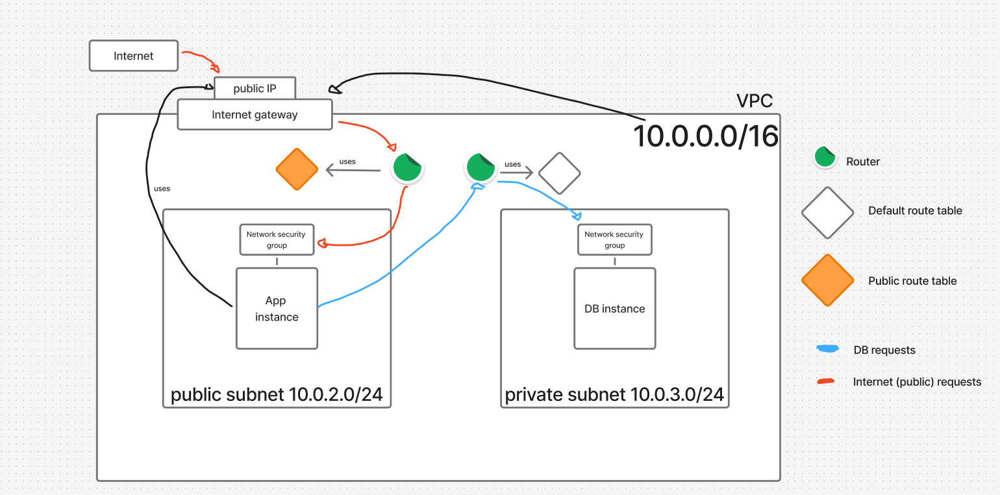
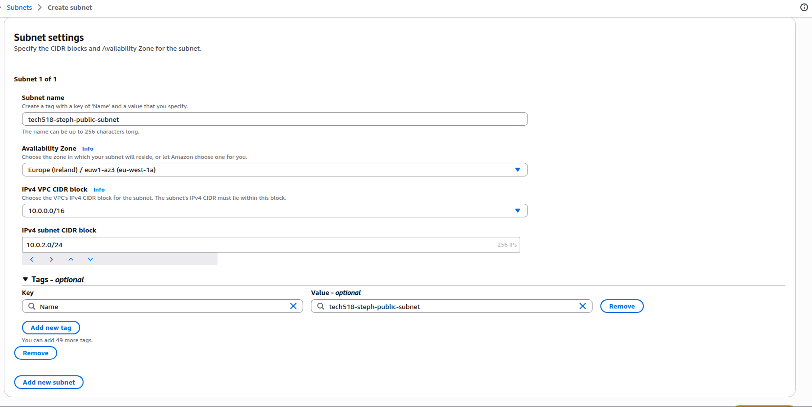
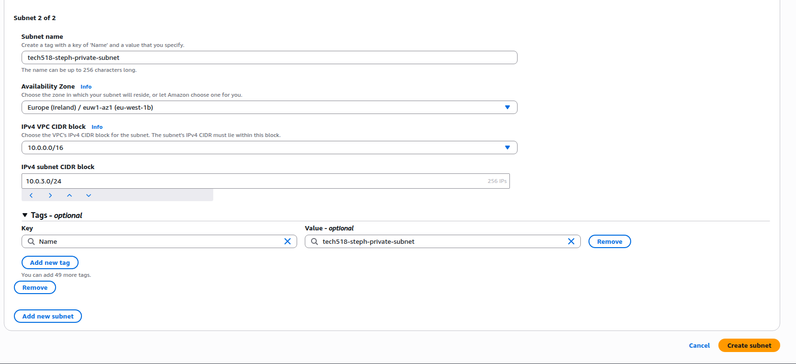
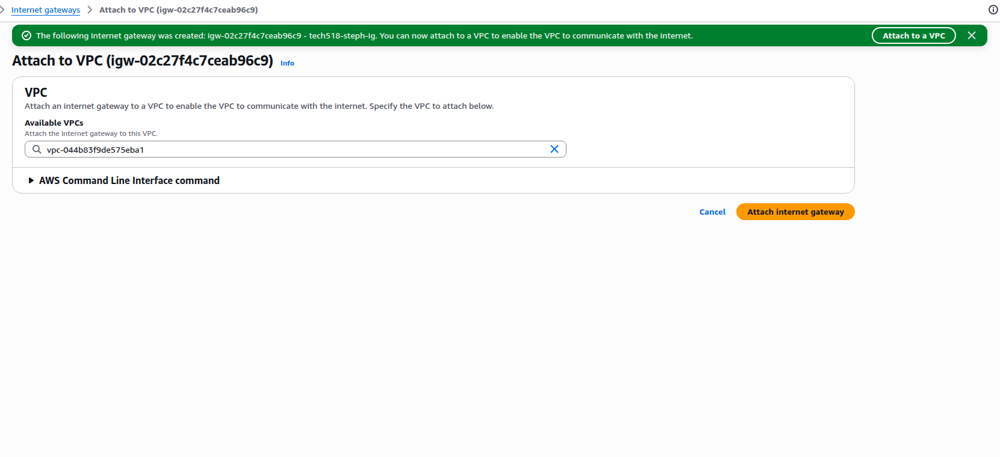
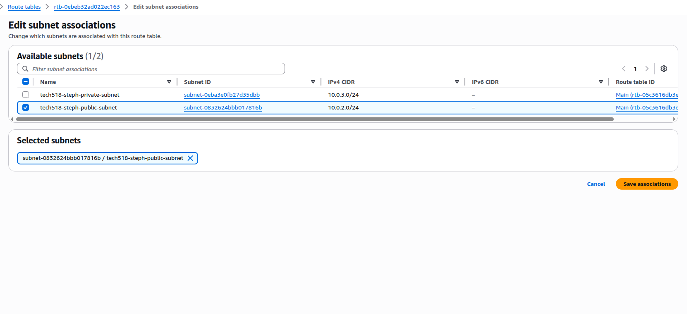
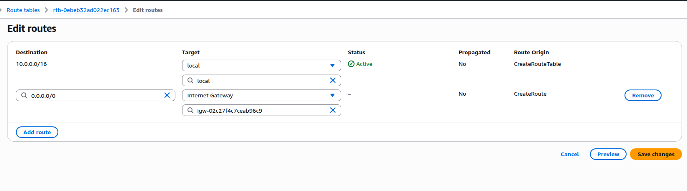
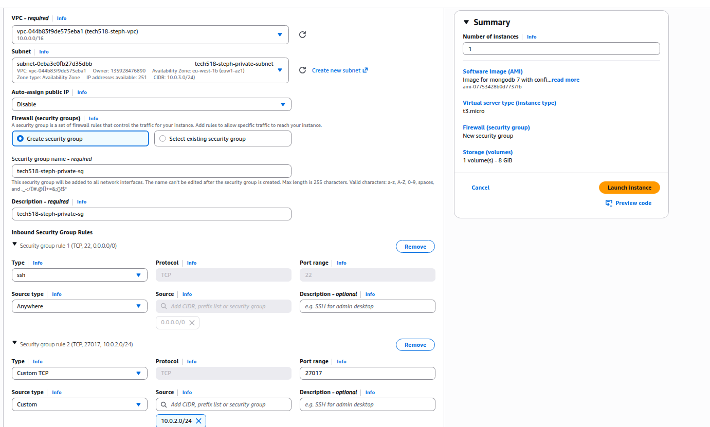
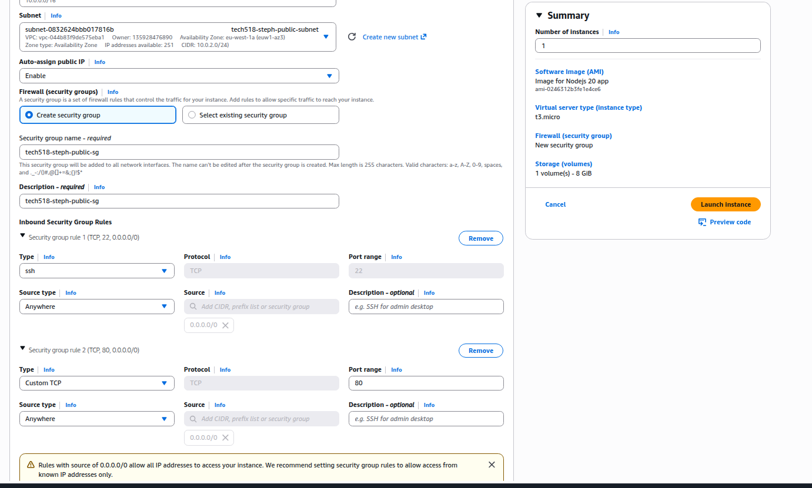

# VPC
- virtual private clouds
- they are secure private clouds isolated within a public cloud
- other users will not be able to access a vpc without permission
  


# VPC creation prerequisites

- will contain an internet gateway (how the traffic will be processed), a public router and a default route table to request the database
- will contain a CIDR block (10.0.0.0/16 - CIDR block range is 16, everything within the VPC will start with 10.0)
- two subnets, one public (10.0.0.2.0/24) and one private (10.0.0.3.0/24)
  each subnet will need CIDR blocks, but will have a much smaller range
- public subnet will contain instance with the app
- private subnet will contain instance with the database
- internet gateway
- route table
- app instance and database instance



# Creating a VPC

- access through the VPC dashboard
- click create VPC
- select VPC only
- use a descriptive name eg. se-steph-2tier-vpc
- manually create IPv4 CIDR block 10.0.0.0/16 (must be large enough to contain all subnets and their instances) - 10.0 will be static, the rest is dynamic
- do not add IPv6 CIDR block
- leave tenancy option as default
- do not at VPC encryption control
- click create VPC

# Creating subnets

- under the subnets tab, click create subnet
- use your newly created VPC for the subnet to be housed in
- name your subnet
- assign the subnet to availability zone eu-west-1a
- create CIDR block within the subnet 10.0.2.0/24 (for public) - making more of the subnet mask more static to limit number of available privte IP addresses 
- add a new subnet and repeat the instructions to create the private subnet
- can assign the subnet to a different availability zone for robustness
- private CIDR block should be 10.0.3.0/24 
- press create subnet

# Creating internet gateway

- under internet gateway tab, select create internet gateway
- name the internet gateway
- attach it to the created vpc by selecting attach to a vpc (green button at the top of the page) 

# Creating route tables

- create a new public route table
- name the route table eg. se-steph-2tier-vpc-public-rt
- assign your created VPC
- the route table is not yet associated to a subnet
- under the route table summary, edit subnet associations
- select the public CIDR block 
- add route for the internet 0.0.0.0/0 and target the newly created internet gateway by selecting edit routes button 
- the private subnet is already connected to the default route table, for internal traffic only - has no access to the internet

# Deploying database instance within private subnet

- make sure the name is descriptive eg. se-steph-db-in-private-subnet
- select mongodb image in my AMIs
- leave instance type as normal
- leave instance type as default (t3.micro)
- assign your key pair

**Network setting config:**

- select edit under network settings section
- select your newly made vpc
- make sure the subnet is set to private for the database instance - to keep it secure
- make sure public IP is disabled - private subnet has no ability to access the internet
- security groups only exist in vpc, so new ones must be created
- eg. se-steph-mongodb-private-subnet-sg
- add a new security group rule with custom tcp type and listening on port 27017 for the database
- add 10.0.2.0/24 (public subnet ip) as the source - allows public instance subnet to access the private subnet
- leave other settings as default
- select create instance
- the instance will not have a public ip
- the private ip will correspond to the private CIDR block 10.0.3.x
- unable to access through public ip address
- also unable to log in through ssh client - can move private key file into instance in public subnet to log into the database instance from the app instance


# Deploying app instance in public subnet

- select the app image from my AMI section
- leave instance type as normal
- use your key pair login

**Network settings config:**

- select public subnet
- enable auto assign public ip - allows you to access through the browser
- leave first security group rule as is
- add HTTP type to add port 80
- set source as 0.0.0.0
  
  

# Connecting the public instance to the private instance

- add a bash script to the user data within the app instance (public)

```
#!/bin/bash
sleep 15

cd /home/ubuntu

cd se-sparta-test-app

cd app

export DB_HOST=mongodb://<private-instance-ip>:27017/posts

sudo npm install

node seeds/seed.js

pm2 start app.js
```

- if user data is not working, log in via ssh as ubuntu (not root)

```
# cd to the correct folder
cd se-sparta-test-app

cd app

# set up DB connection
export DB_HOST=mongodb://<private-instance-ip>:27017/posts

sudo npm install

node seeds/seed.js

pm2 start app.js
```
